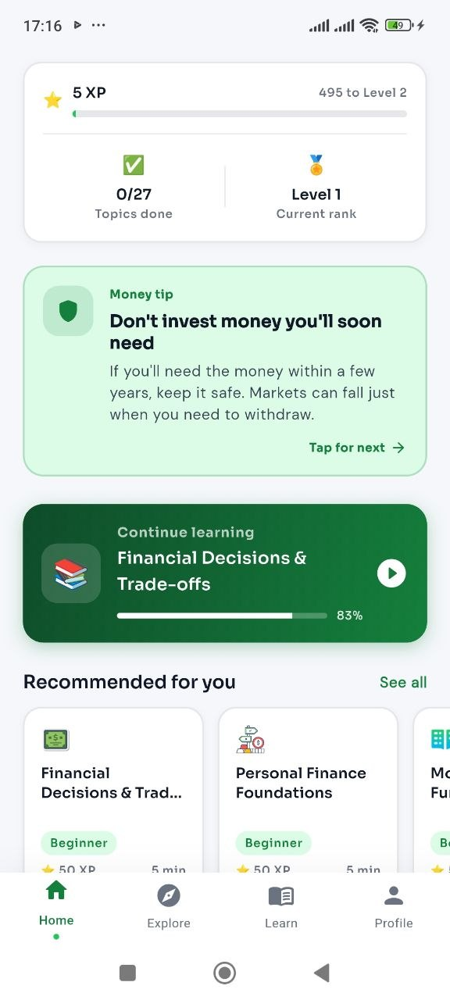
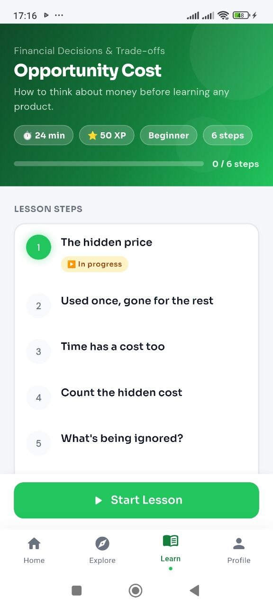
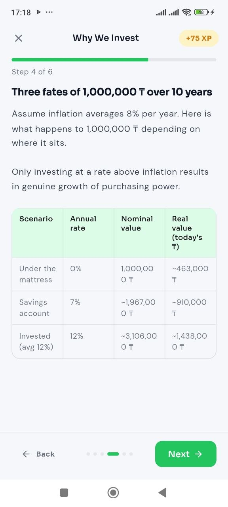
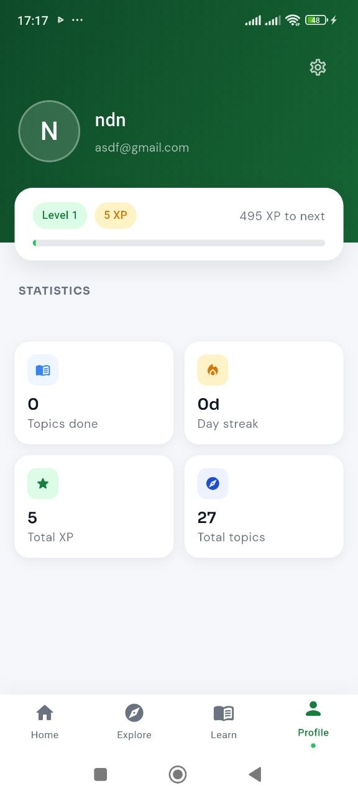
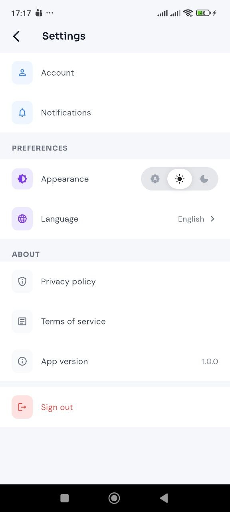

# Smartfin

**Smartfin** is a cross-platform personal-finance learning app. It turns a structured financial-literacy curriculum into short lessons, quizzes, progress milestones, and personalized next-topic recommendations.

## Highlights

- Authentication with email/password and Google Sign-In
- Guided onboarding with language and learning-preference settings
- Finance curriculum split into topics, lessons, and interactive quizzes
- Progress, XP, streaks, and a personalized learning path
- Adaptive recommendations and spaced-repetition support through the backend
- Offline-friendly curriculum and tip caching with Hive
- Light/dark themes and English, Russian, and Kazakh UI support

## Screenshots

<p align="center">
  
  
  
</p>
<p align="center">
  
  
  
</p>

## Tech stack

| Area | Tools |
| --- | --- |
| UI | Flutter, Material 3, Google Fonts, Flutter Animate |
| State & navigation | Riverpod, GoRouter |
| Networking | Dio with automatic token refresh |
| Local data | Hive, Flutter Secure Storage |
| Platform | Android, iOS, Web, macOS, Linux |
| Quality | flutter_lints, widget/unit tests, GitHub Actions |

## Architecture

The codebase follows a feature-first, layered structure. Features own their presentation, domain, and data code; shared infrastructure stays in `lib/core`.

```text
lib/
├── core/                 # API client, routing, theme, localization, storage
├── features/
│   ├── auth/             # sign-in, registration, session handling
│   ├── onboarding/       # learner profile setup
│   ├── home/             # dashboard and finance tips
│   ├── explore/          # curriculum discovery and topic previews
│   ├── learn/            # lesson flow, quizzes, completion
│   └── profile/          # profile and settings
└── main.dart
```

Within a feature, dependencies point inward: `presentation → domain ← data`. Repositories isolate API and local-cache details from UI code.

## Getting started

### Prerequisites

- Flutter SDK compatible with Dart `^3.9.2`
- An Android/iOS simulator, device, or Chrome for web
- A running backend service (optional for static UI work)

```bash
git clone https://github.com/alisherseitkadyr/smartfin.git
cd smartfin
flutter pub get
flutter run --dart-define=API_BASE_URL=http://10.0.2.2:8081
```

`API_BASE_URL` is optional. When it is omitted, the app uses the deployed demo API. Pass a local URL for development. The value may include `/api`, but does not have to—the client normalizes it.

For a physical Android device, expose your local backend with `adb reverse tcp:8081 tcp:8081` and use `http://localhost:8081`.

## Quality checks

```bash
dart format --output=none --set-exit-if-changed lib test
flutter analyze
flutter test
```

Every pull request that changes the Flutter app runs these checks in GitHub Actions.

## Repository notes

- Do not commit credentials, signing keys, or `.env` files.
- The app persists access and refresh tokens in platform secure storage.
- API requests transparently attempt one serialized token refresh after a `401` response.

## License

This project is created for educational and portfolio purposes. All rights reserved unless a separate license is added.
